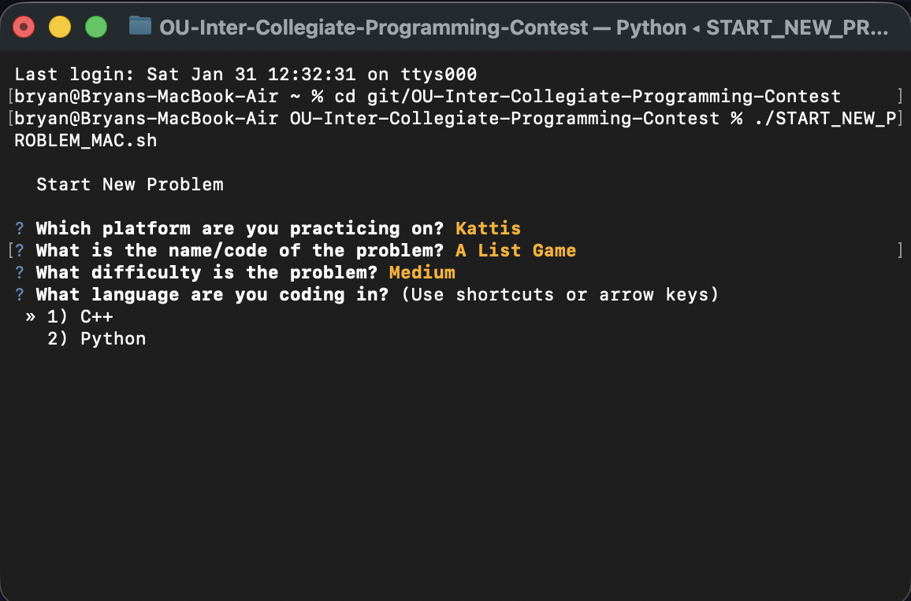

When you start a new practice problem, run the CLI tool to jump to the right place and create a folder with a working template (C++ or Python).

**After finishing a problem**, remember to note:
- The problem URL
- Who participated
- Time to complete